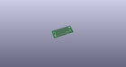
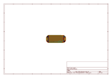
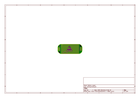
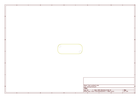
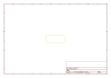
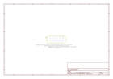

# OOMP Project  
## MyoWare_Proto_Shield  by sparkfun  
  
(snippet of original readme)  
  
MyoWare™ Proto Shield  
========================================  
  
  
  
[*MyoWare™ Proto Shield (BOB-13709)*](https://www.sparkfun.com/products/13709)  
  
The MyoWare™ Proto Shield is designed to pair with the MyoWare™ Muscle Sensor. This shield provides 8 x 15 solderable through holes on a standard 0.1" grid.  
  
Repository Contents  
-------------------  
  
* **/Hardware** - Eagle design files (.brd, .sch)  
  
Documentation  
--------------  
* **[Hookup Guide](https://learn.sparkfun.com/tutorials/myoware-muscle-sensor-kit)** - Basic hookup guide for the MyoWare™ Proto Shield.  
  
Product Versions  
----------------  
* [v1.0](https://www.sparkfun.com/products/13709)- MyoWare™ Proto Shield  
  
License Information  
-------------------  
  
This product is _**open source**_!  
  
Please review the LICENSE.md file for license information.  
  
If you have any questions or concerns on licensing, please contact techsupport@sparkfun.com.  
  
Distributed as-is; no warranty is given.  
  
- Your friends at SparkFun.  
  
Designed by Brian E. Kaminski of Advancer Technologies  
  
  full source readme at [readme_src.md](readme_src.md)  
  
source repo at: [https://github.com/sparkfun/MyoWare_Proto_Shield](https://github.com/sparkfun/MyoWare_Proto_Shield)  
## Board  
  
  
## Schematic  
  
  
  
[schematic pdf](working_schematic.pdf)  
## Images  
  
  
  
  
  
  
  
  
  
  
  
  
  
  
  
  
