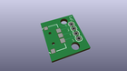
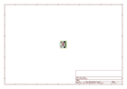
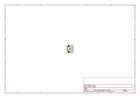
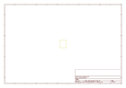
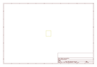
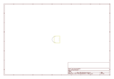

# OOMP Project  
## Navigation_Switch_Breakout  by sparkfun  
  
(snippet of original readme)  
  
Navigation Switch Breakout  
==========================  
  
[    
*Surface Mount Navigation Switch Breakout (COM-08236)*](https://www.sparkfun.com/products/8236)  
  
This is a fully assembled simple breakout board for the surface mount 3-way switch.   
  
Repository Contents  
-------------------  
* **/Hardware** - All Eagle design files (.brd, .sch, .STL)  
  
License Information  
-------------------  
The hardware is released under [Creative Commons Share-alike 3.0](http://creativecommons.org/licenses/by-sa/3.0/).    
  
  
  full source readme at [readme_src.md](readme_src.md)  
  
source repo at: [https://github.com/sparkfun/Navigation_Switch_Breakout](https://github.com/sparkfun/Navigation_Switch_Breakout)  
## Board  
  
  
## Schematic  
  
  
  
[schematic pdf](working_schematic.pdf)  
## Images  
  
  
  
  
  
  
  
  
  
  
  
  
  
  
  
  
