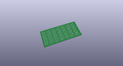
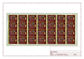
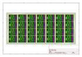
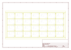
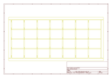
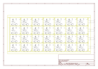

# OOMP Project  
## Noisy_Cricket-1.5W_Stereo_Amplifier_Breakout  by sparkfun  
  
(snippet of original readme)  
  
SparkFun Noisy Cricket Stereo Amplifier - 1.5W  
==========================================  
  
  
  
[*SparkFun Noisy Cricket Stereo Amplifier - 1.5W (DEV-14475)*](https://www.sparkfun.com/products/14475)  
  
The Noisy Cricket is a 300mW stereo amplifier which can be configured to output up to 1.5W of mono amplification.  
With a dual-gang pot you can control the volume with a single pot, as well as turn power on and off!  
  
Repository Contents  
-------------------  
* **/Hardware** - All Eagle design files (.brd, .sch)  
* **/Production** - Test bed files and production panel files  
  
  
Documentation  
--------------  
* **[Hookup Guide](https://learn.sparkfun.com/tutorials/noisy-cricket-stereo-amplifier---15w-hookup-guide)** - Basic hookup guide for the Noisy Cricket.  
  
License Information  
-------------------  
  
This product is _**open source**_!   
  
Please review the LICENSE.md file for license information.   
  
If you have any questions or concerns on licensing, please contact techsupport@sparkfun.com.  
  
Distributed as-is; no warranty is given.  
  
- Your friends at SparkFun.  
  full source readme at [readme_src.md](readme_src.md)  
  
source repo at: [https://github.com/sparkfun/Noisy_Cricket-1.5W_Stereo_Amplifier_Breakout](https://github.com/sparkfun/Noisy_Cricket-1.5W_Stereo_Amplifier_Breakout)  
## Board  
  
  
## Schematic  
  
  
  
[schematic pdf](working_schematic.pdf)  
## Images  
  
  
  
  
  
  
  
  
  
  
  
  
  
  
  
  
