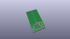
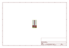
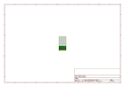
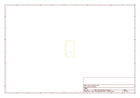
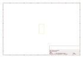
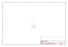

# OOMP Project  
## nRF2401A_Transceiver-Trace_Antenna  by sparkfun  
  
(snippet of original readme)  
  
nRF2401A Transceiver- Trace Antenna  
==================================  
[    
*nRF2401A Transceiver with Trace Antenna (WRL-00153)*](https://github.com/sparkfun/nRF2401A_Transceiver-Trace_Antenna)  
  
This is a breakout board for the nRF2401A 2.4GHz transceiver module with a built-in trace antenna.   
  
Repository Contents  
-------------------  
* **/Firmware** - Example firmware to use with the chip  
* **/Hardware** - All Eagle design files (.brd, .sch)  
  
  
License Information  
-------------------  
The hardware is released under [Creative Commons Share-alike 3.0](http://creativecommons.org/licenses/by-sa/3.0/).    
All other code is open source so please feel free to do anything you want with it;   
you buy me a beer if you use this and we meet someday ([Beerware license](http://en.wikipedia.org/wiki/Beerware)).  
  full source readme at [readme_src.md](readme_src.md)  
  
source repo at: [https://github.com/sparkfun/nRF2401A_Transceiver-Trace_Antenna](https://github.com/sparkfun/nRF2401A_Transceiver-Trace_Antenna)  
## Board  
  
  
## Schematic  
  
  
  
[schematic pdf](working_schematic.pdf)  
## Images  
  
  
  
  
  
  
  
  
  
  
  
  
  
  
  
  
