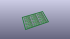
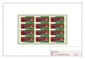
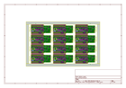
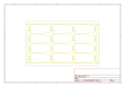
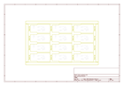
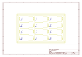
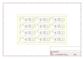

# OOMP Project  
## nRF52840_Breakout_MDBT50Q  by sparkfun  
  
(snippet of original readme)  
  
SparkFun Pro nRF52840 Mini - Bluetooth Development Board  
========================================  
  
  
  
[*SparkFun Pro nRF52840 Mini - Bluetooth Development Board (DEV-15025)*](https://www.sparkfun.com/products/15025)  
  
<Basic description of the part.>  
  
Repository Contents  
-------------------  
  
* **/Documentation** - Data sheets, additional product information  
* **/Firmware** -- nRF5 SDK and Arduino firmware components  
  * **/Arduino** -- Board definitions and variants for installing in the [nRF52 Arduino Core](https://github.com/adafruit/Adafruit_nRF52_Arduino)  
  * **/nRF5_SDK** -- Board definitions for use in the nRF5 SDK.  
* **/Hardware** - Eagle design files (.brd, .sch)  
* **/Production** - Production panel files (.brd)  
  
Documentation  
--------------  
* **[Hookup Guide](https://learn.sparkfun.com/tutorials/sparkfun-pro-nrf52840-mini-hookup-guide)** - Basic hookup guide for the Pro nrf52840.  
  
Product Versions  
----------------  
* [DEV-15025](https://www.sparkfun.com/products/15025)- The SparkFun Pro nRF52840 Mini is a breakout and development board for Nordic Semiconductor’s nRF52840 – a powerful combination of ARM Cortex-M4 CPU and 2.4 GHz Bluetooth radio. With the nRF52840 at the heart of your project, you’ll be presented with a seemingly endless list of project-possibilities.  
  
License Information  
--------  
  full source readme at [readme_src.md](readme_src.md)  
  
source repo at: [https://github.com/sparkfun/nRF52840_Breakout_MDBT50Q](https://github.com/sparkfun/nRF52840_Breakout_MDBT50Q)  
## Board  
  
  
## Schematic  
  
  
  
[schematic pdf](working_schematic.pdf)  
## Images  
  
  
  
  
  
  
  
  
  
  
  
  
  
  
  
  
