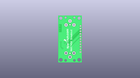
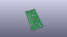
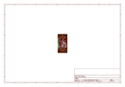
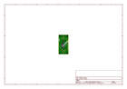
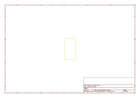
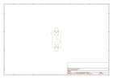

# OOMP Project  
## On_Screen_Display_Breakout-MAX7456  by sparkfun  
  
(snippet of original readme)  
  
SparkFun On Screen Display Breakout - MAX7456  
========================================  
  
  
  
[*SparkFun On Screen Display Breakout - MAX7456 (BOB-09168)*](https://www.sparkfun.com/products/9168)  
  
This is a breakout board for the Maxim MAX7456 monochrome on-screen display chip.   
The board is set up with all supporting circuitry and RCA connectors to allow the user to easily interrupt and overlay text and/or graphics onto a video signal (PAL or NTSC).  
  
Repository Contents  
-------------------  
* **/Firmware** - Example code   
* **/Hardware** - Eagle design files (.brd, .sch)  
* **/Production** - Production panel files (.brd)  
  
Documentation  
--------------  
* **[SparkFun Fritzing repo](https://github.com/sparkfun/Fritzing_Parts)** - Fritzing diagrams for SparkFun products.  
* **[SparkFun 3D Model repo](https://github.com/sparkfun/3D_Models)** - 3D models of SparkFun products.   
  
  
License Information  
-------------------  
This product is _**open source**_!   
  
The **hardware** is released under [Creative Commons ShareAlike 4.0 International](https://creativecommons.org/licenses/by-sa/4.0/).  
  
The **code** is beerware; if you see me (or any other SparkFun employee) at the local, and you've found our code helpful, please buy us a round!  
  
Please use, reuse, and modify these files as you see fit. Please maintain attribution to SparkFun Electronics and release anything derivative under the same  
  full source readme at [readme_src.md](readme_src.md)  
  
source repo at: [https://github.com/sparkfun/On_Screen_Display_Breakout-MAX7456](https://github.com/sparkfun/On_Screen_Display_Breakout-MAX7456)  
## Board  
  
  
## Schematic  
  
  
  
[schematic pdf](working_schematic.pdf)  
## Images  
  
  
  
  
  
  
  
  
  
  
  
  
  
  
  
  
