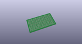
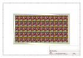
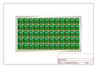
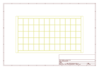
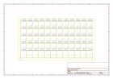
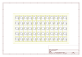

# OOMP Project  
## OpenLog  by sparkfun  
  
(snippet of original readme)  
  
SparkFun OpenLog  
================  
  
<table class="table table-hover table-striped table-bordered">  
  <tr align="center">  
   <td></td>  
   <td></td>  
  </tr>  
  <tr align="center">  
    <td><i>SparkFun OpenLog (<a href="https://www.sparkfun.com/products/13712">DEV-13712</a>)</i></td>  
    <td><i>SparkFun OpenLog with Headers (<a href="https://www.sparkfun.com/products/13955">DEV-13955</a>)</i></td>  
  </tr>  
</table>  
  
OpenLog is an open source data logger that works over a simple serial connection and supports microSD cards up to 64GB.   
  
Repository Contents  
-------------------  
* **/Documentation** - Data sheets, additional product information  
* **/Firmware** - Example sketches for the OpenLog, and for an Arduino connected to the OpenLog.  
* **/Hardware** - Hardware design files for the OpenLog PCB. These files were designed in Eagle CAD.  
* **/Libraries** - Libraries for use with the OpenLog.  
* **/Production** - Production panel files (.brd)  
  
Documentation  
--------------  
* **[Hookup Guide](https://learn.sparkfun.com/tutorials/openlog-hookup-guide)** - Basic hookup guide for the OpenLog.  
* **[SparkFun Fritzing repo](https://github.com  
  full source readme at [readme_src.md](readme_src.md)  
  
source repo at: [https://github.com/sparkfun/OpenLog](https://github.com/sparkfun/OpenLog)  
## Board  
  
  
## Schematic  
  
  
  
[schematic pdf](working_schematic.pdf)  
## Images  
  
  
  
  
  
  
  
  
  
  
  
  
  
  
  
  
