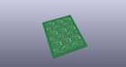
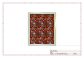
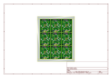
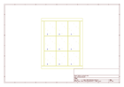
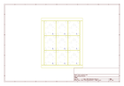
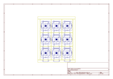
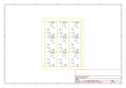

# OOMP Project  
## OpenPIR  by sparkfun  
  
(snippet of original readme)  
  
OpenPIR  
==========  
  
[*OpenPIR  
(SEN-13968)*](https://www.sparkfun.com/products/13968)  
  
OpenPIR is an open source general purpose passive long-wave infrared motion   
detection sensor.  
  
Repository Contents  
-------------------  
* **/Documentation** - Datasheets for parts used in this design  
* **/Hardware** - All Eagle design files  
* **/Production** - Panel files used by SFE production for ordering  
  
License Information  
-------------------  
The hardware is released under [Creative Commons Share-alike  
4.0](http://creativecommons.org/licenses/by-sa/4.0/).    
All other code is open source so please feel free to do anything you want with  
it; you buy me a beer if you use this and we meet someday ([Beerware  
license](http://en.wikipedia.org/wiki/Beerware)).  
  
  full source readme at [readme_src.md](readme_src.md)  
  
source repo at: [https://github.com/sparkfun/OpenPIR](https://github.com/sparkfun/OpenPIR)  
## Board  
  
  
## Schematic  
  
  
  
[schematic pdf](working_schematic.pdf)  
## Images  
  
  
  
  
  
  
  
  
  
  
  
  
  
  
  
  
