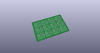
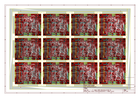
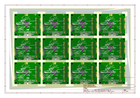
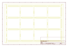
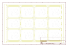
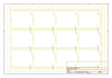
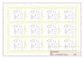

# OOMP Project  
## OpenScale  by sparkfun  
  
(snippet of original readme)  
  
SparkFun OpenScale  
===========================================================  
  
  
  
[*SparkFun OpenScale (SEN-13261)*](https://www.sparkfun.com/products/13261)  
  
The SparkFun OpenScale is a simple-to-use, open source solution for measuring weight and temperature. It has the ability to read multiple types of load cells and offers a simple-to-use serial menu to configure calibration value, sample rate, time stamp and units of precision.  
  
Simply attach a four-wire or five-wire load cell of any capacity, plug the OpenScale into a USB port, open a terminal window at 9,600bps, and you’ll immediately see mass readings. The SparkFun OpenScale will enable you to turn a load cell or four load sensors in a Wheatstone bridge configuration into the DIY weigh scale for your application.  
  
The OpenScale was designed for projects and applications where the load was static (like the beehive in front of SparkFun HQ) or where constant readings are needed without user intervention (for example, on a conveyor belt system). A load cell with an equipped OpenScale can remain in place for months without needing user interaction!  
  
On board the SparkFun OpenScale is the ATmega328P microcontroller, for addressing your communications needs and transferring your data to a serial terminal or to a data logger such as the OpenLog, an FT231 with mini USB, for USB to serial connection; the  
  full source readme at [readme_src.md](readme_src.md)  
  
source repo at: [https://github.com/sparkfun/OpenScale](https://github.com/sparkfun/OpenScale)  
## Board  
  
  
## Schematic  
  
  
  
[schematic pdf](working_schematic.pdf)  
## Images  
  
  
  
  
  
  
  
  
  
  
  
  
  
  
  
  
