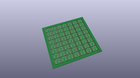
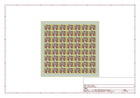
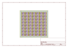
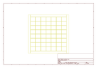
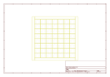
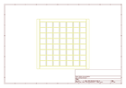
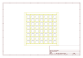

# OOMP Project  
## Opto_Isolator_Breakout  by sparkfun  
  
(snippet of original readme)  
  
SparkFun Opto-isolator Breakout   
===============================  
  
  
  
[*SparkFun Opto-isolator Breakout  (BOB-09118)*](https://www.sparkfun.com/products/9118)  
  
This is a board designed for opto-isolation.   
This board is helpful for connecting digital systems (like a 5V microcontroller) to a high-voltage or noisy system.   
This board electrically isolates a controller from the high-power system by use of an opto-isolator IC.  
  
Repository Contents  
-------------------  
  
* **/Hardware** - Eagle design files (.brd, .sch)  
* **/Production** - Production panel files (.brd)  
  
Documentation  
--------------  
* **[SparkFun Fritzing repo](https://github.com/sparkfun/Fritzing_Parts)** - Fritzing diagrams for SparkFun products.  
* **[SparkFun 3D Model repo](https://github.com/sparkfun/3D_Models)** - 3D models of SparkFun products.   
  
  
License Information  
-------------------  
  
This product is _**open source**_!   
  
Please review the LICENSE.md file for license information.   
  
If you have any questions or concerns on licensing, please contact techsupport@sparkfun.com.  
  
Distributed as-is; no warranty is given.  
  
- Your friends at SparkFun.  
  full source readme at [readme_src.md](readme_src.md)  
  
source repo at: [https://github.com/sparkfun/Opto_Isolator_Breakout](https://github.com/sparkfun/Opto_Isolator_Breakout)  
## Board  
  
  
## Schematic  
  
  
  
[schematic pdf](working_schematic.pdf)  
## Images  
  
  
  
  
  
  
  
  
  
  
  
  
  
  
  
  
