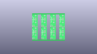
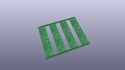
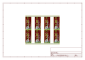
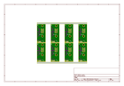
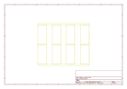
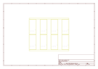
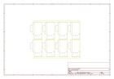

# OOMP Project  
## Papilio_VGA_Wing  by sparkfun  
  
oomp key: oomp_projects_flat_sparkfun_papilio_vga_wing  
(snippet of original readme)  
  
Papilio VGA Wing  
================  
  
[    
*Papilio VGA Wing (WIG-11569)*](https://www.sparkfun.com/products/11569)  
  
This board allows you to quickly add VGA output to your Papilio FPGA board.   
  
Repository Contents  
-------------------  
* **/Hardware** - All Eagle design files (.brd, .sch)  
* **/Production** - Test bed files and production panel files  
  
License Information  
-------------------  
The hardware is released under [Creative Commons Share-alike 3.0](http://creativecommons.org/licenses/by-sa/3.0/).    
  full source readme at [readme_src.md](readme_src.md)  
  
source repo at: [https://github.com/sparkfun/Papilio_VGA_Wing](https://github.com/sparkfun/Papilio_VGA_Wing)  
## Board  
  
  
## Schematic  
  
  
  
[schematic pdf](working_schematic.pdf)  
## Images  
  
  
  
  
  
  
  
  
  
  
  
  
  
  
  
  
