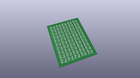
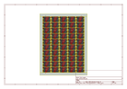
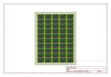
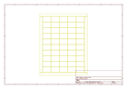
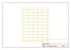
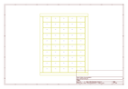
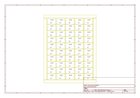

# OOMP Project  
## PCA9306_Level_Translator_Breakout  by sparkfun  
  
(snippet of original readme)  
  
PCA9306 Level Translator Breakout  
=================================  
  
  
  
[*PCA9306 Level Translator Breakout(BOB-15439)*](https://www.sparkfun.com/products/15439)  
  
This is a breakout board for the PCA9306 dual bidirectional voltage-level translator.   
  
Repository Contents  
-------------------  
* **/Hardware** - Eagle design files for the board (.brd, .sch)  
  
Documentation  
--------------  
* **[Hookup Guide](https://learn.sparkfun.com/tutorials/pca9306-logic-level-translator-hookup-guide-v2)** - Basic hookup guide for the PCA9306 logic level translator.  
* **[Logic Levels](https://learn.sparkfun.com/tutorials/logic-levels)**  
* **[SparkFun Fritzing repo](https://github.com/sparkfun/Fritzing_Parts)** - Fritzing diagrams for SparkFun products.  
  
License Information  
-------------------  
The hardware is released under [Creative Commons Share-alike 3.0](http://creativecommons.org/licenses/by-sa/3.0/).    
  
  
  full source readme at [readme_src.md](readme_src.md)  
  
source repo at: [https://github.com/sparkfun/PCA9306_Level_Translator_Breakout](https://github.com/sparkfun/PCA9306_Level_Translator_Breakout)  
## Board  
  
  
## Schematic  
  
  
  
[schematic pdf](working_schematic.pdf)  
## Images  
  
  
  
  
  
  
  
  
  
  
  
  
  
  
  
  
