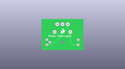
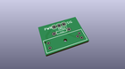
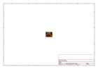
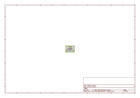
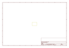
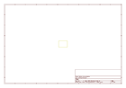

# OOMP Project  
## Photo_Interrupter_Breakout  by sparkfun  
  
oomp key: oomp_projects_flat_sparkfun_photo_interrupter_breakout  
(snippet of original readme)  
  
Photo_Interrupter_Breakout  
==========================  
  
[  
*Photo Interrupter Breakout Board (BOB-09322)*](https://www.sparkfun.com/products/9322)  
  
Photo Interrupter Breakout Board - GP1A57HRJ00F available from SparkFun Electronics.   
  
  
Repository Contents  
-------------------  
* **/Firmware** - Any firmware that the part ships with,   
* **/Hardware** - All Eagle design files (.brd, .sch)  
  
  
License Information  
-------------------  
The hardware is released under [Creative Commons ShareAlike 4.0 International](https://creativecommons.org/licenses/by-sa/4.0/).  
The code is beerware; if you see me (or any other SparkFun employee) at the local, and you've found our code helpful, please buy us a round!  
  
Distributed as-is; no warranty is given.  
  
  full source readme at [readme_src.md](readme_src.md)  
  
source repo at: [https://github.com/sparkfun/Photo_Interrupter_Breakout](https://github.com/sparkfun/Photo_Interrupter_Breakout)  
## Board  
  
  
## Schematic  
  
  
  
[schematic pdf](working_schematic.pdf)  
## Images  
  
  
  
  
  
  
  
  
  
  
  
  
  
  
  
  
