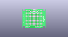
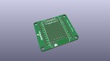
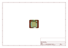
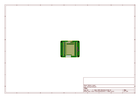
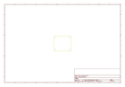
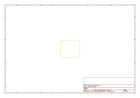
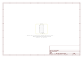

# OOMP Project  
## Photon_Proto_Shield  by sparkfun  
  
oomp key: oomp_projects_flat_sparkfun_photon_proto_shield  
(snippet of original readme)  
  
SparkFun Photon ProtoShield  
============================  
  
  
  
[*SparkFun Photon ProtoShield (DEV-13598)*](https://www.sparkfun.com/products/13598)  
  
This ProtoShield mates easily with your Photon module and provides a small soldering area and separated power and I2C hook-ups.   
With the SparkFun Photon ProtoShield you have the control over what kind of project you design for your Photon.  
  
Repository Contents  
-------------------  
  
* **/Hardware** - Eagle design files (.brd, .sch)  
  
Documentation  
--------------  
* **[Photon Development Guide](https://learn.sparkfun.com/tutorials/photon-development-guide)** - Basic guide for the Photon and SparkFun boards.  
* **[SparkFun Fritzing repo](https://github.com/sparkfun/Fritzing_Parts)** - Fritzing diagrams for SparkFun products.  
* **[SparkFun 3D Model repo](https://github.com/sparkfun/3D_Models)** - 3D models of SparkFun products.   
  
  
License Information  
-------------------  
  
This product is _**open source**_!   
  
Please review the LICENSE.md file for license information.   
  
If you have any questions or concerns on licensing, please contact techsupport@sparkfun.com.  
  
Distributed as-is; no warranty is given.  
  
- Your friends at SparkFun.  
  
  full source readme at [readme_src.md](readme_src.md)  
  
source repo at: [https://github.com/sparkfun/Photon_Proto_Shield](https://github.com/sparkfun/Photon_Proto_Shield)  
## Board  
  
  
## Schematic  
  
  
  
[schematic pdf](working_schematic.pdf)  
## Images  
  
  
  
  
  
  
  
  
  
  
  
  
  
  
  
  
