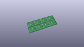
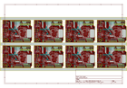
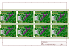
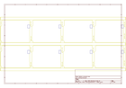
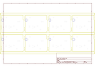
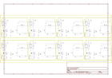

# OOMP Project  
## Photon_RedBoard  by sparkfun  
  
oomp key: oomp_projects_flat_sparkfun_photon_redboard  
(snippet of original readme)  
  
SparkFun Photon RedBoard  
========================================  
  
  
  
[*SparkFun Photon RedBoard (DEV-13321)*](https://www.sparkfun.com/products/13321)  
  
The SparkFun Photon RedBoard is a Particle Cloud-compatible WiFi development board. It can be programmed over-the-air, using Particle's Build IDE. It's like a Photon, but Arduino-shaped and red!  
  
Repository Contents  
-------------------  
  
* **/Documentation** - Data sheets, additional product information  
* **/Hardware** - Eagle design files (.brd, .sch)  
* **/Production** - Production panel files (.brd)  
  
Documentation  
--------------  
* **[Hookup Guide](https://learn.sparkfun.com/tutorials/photon-redboard-hookup-guide)** - Basic hookup guide for the SparkFun Photon RedBoard.  
* **[Experiment Guide](https://learn.sparkfun.com/tutorials/photon-redboard-hookup-guide)** - Experiment guide for the SparkFun Photon RedBoard to send and receive data over WiFi.  
* **[SparkFun Fritzing repo](https://github.com/sparkfun/Fritzing_Parts)** - Fritzing diagrams for SparkFun products.  
* **[SparkFun 3D Model repo](https://github.com/sparkfun/3D_Models)** - 3D models of SparkFun products.   
  
Product Versions  
----------------  
* [DEV-13321](https://www.sparkfun.com/products/13321) - **Photon RedBoard**: Initial release of the SparkFun Photon RedBoard.  
* [KIT-13320](https://www.sparkfun.com/products/13320) - **SparkFun Inventor's Kit for Photon**: A SparkFun Inventor  
  full source readme at [readme_src.md](readme_src.md)  
  
source repo at: [https://github.com/sparkfun/Photon_RedBoard](https://github.com/sparkfun/Photon_RedBoard)  
## Board  
  
  
## Schematic  
  
  
  
[schematic pdf](working_schematic.pdf)  
## Images  
  
  
  
  
  
  
  
  
  
  
  
  
  
  
  
  
