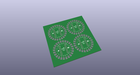
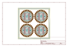
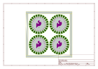
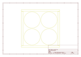
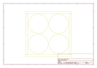
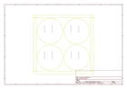

# OOMP Project  
## Photon_Wearable_Shield  by sparkfun  
  
oomp key: oomp_projects_flat_sparkfun_photon_wearable_shield  
(snippet of original readme)  
  
SparkFun Photon Wearable Shield  
  
========================================  
  
  
  
[*SparkFun Photon Wearable Shield (DEV-13328)*](https://www.sparkfun.com/products/13328)  
  
The SparkFun Photon Wearable Shield makes it easy to add the WiFi enabled Photon to any wearables project. Each pin on the Photon is broken out into large sewing pins. Use conductive thread to make your next wearables projects. The large pins are also great for using conductive paint to create any project that needs WiFi. There are even optional smaller pins for soldering flexible wires. The SparkFun Photon Wearable Shield comes with the headers already soldered on, so you can plug and play!  
  
The Particle Photon is a tiny WiFi development kit for creating connected projects and products. Sporting a 120Mhz ARM Cortex M3 and built-in WiFi, the Photon is not only powerful, but easy to use. The small form factor is ideal for IoT projects with cloud-connectivity.  
  
Note: This Photon Wearable Shield does not include a Photon module and is currently available for preorder with a tentative release date of June 2015.  
  
Features:  
  
* 24 Large Sewing Tabs  
* Headers and Connectors Pre-Soldered  
* Compatible with the Photon and the Core  
  
Repository Contents  
-------------------  
  
* **/Production** - Production panel files (.brd)  
* **/Hardware** - Eagle design files (.brd, .sch)  
  
Documentation  
--------------  
* **[SparkFun Photon Wearab  
  full source readme at [readme_src.md](readme_src.md)  
  
source repo at: [https://github.com/sparkfun/Photon_Wearable_Shield](https://github.com/sparkfun/Photon_Wearable_Shield)  
## Board  
  
  
## Schematic  
  
  
  
[schematic pdf](working_schematic.pdf)  
## Images  
  
  
  
  
  
  
  
  
  
  
  
  
  
  
  
  
