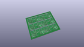
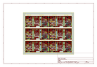
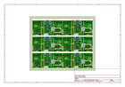
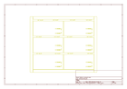
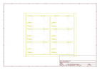
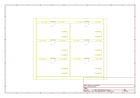
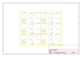

# OOMP Project  
## Photon_Weather_Shield  by sparkfun  
  
(snippet of original readme)  
  
⛔️ Discontinued  
====================  
*This product has been retired from our catalog.*  
  
SparkFun_Photon_Weather_Shield  
===========================  
  
  
  
[*Photon Weather Shield (DEV-13630 )*](https://www.sparkfun.com/products/13630)  
  
The SparkFun Photon Weather Shield is an easy to use add-on board for the Photon form Particle.io, which  grants you access to barometric pressure, relative humidity, and temperature. There are also connections on this shield to optional sensors such as wind speed, direction, rain gauge and soil readings!  
  
Repository Contents  
-------------------  
  
* **/Firmware** - Necessary libraies and example sketches to use the weather shield.   
* **/Hardware** - All Eagle design files (.brd, .sch)  
* **/Production** - Test bed files and production panel files  
  
Documentation  
--------------  
* **[Hookup Guide](https://learn.sparkfun.com/tutorials/photon-weather-shield-hookup-guide)** - Complete hookup guide for the Photon Wetaher Shield.  
* **[SparkFun Fritzing repo](https://github.com/sparkfun/Fritzing_Parts)** - Fritzing diagrams for SparkFun products.  
* **[SparkFun 3D Model repo](https://github.com/sparkfun/3D_Models)** - 3D models of SparkFun products.   
  
Product Versions  
----------------  
* [DEV-13630](https://www.sparkfun.com/products/13630)- Hardware version 1.0  
  
Version History  
---------------  
  
  
License Information  
-------------------  
  
This product is _**open source**_!   
  
Ple  
  full source readme at [readme_src.md](readme_src.md)  
  
source repo at: [https://github.com/sparkfun/Photon_Weather_Shield](https://github.com/sparkfun/Photon_Weather_Shield)  
## Board  
  
  
## Schematic  
  
  
  
[schematic pdf](working_schematic.pdf)  
## Images  
  
  
  
  
  
  
  
  
  
  
  
  
  
  
  
  
