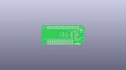
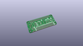
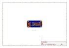
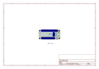
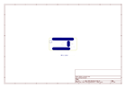
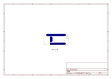
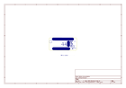
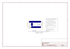

# OOMP Project  
## Pi_Servo_Hat  by sparkfun  
  
(snippet of original readme)  
  
SparkFun Pi Servo pHAT  
=====================  
  
  
  
[SparkFun Servo pHAT for Raspberry Pi (DEV-15316)](https://www.sparkfun.com/products/15316)  
  
<!--  
<table class="table table-hover table-striped table-bordered">  
  <tr align="center">  
   <td></td>  
   <td></td>  
  </tr>  
  <tr align="center">  
    <td><i>Pi Servo Hat [<a href="https://www.sparkfun.com/products/14328">DEV-14328</a>]</i></td>  
    <td><i>SparkFun Raspberry Pi Zero W Camera Kit [<a href="https://www.sparkfun.com/products/14329">KIT-14329</a>]</i></td>  
  </tr>  
</table>  
-->  
  
The Pi Servo pHAT is a hat that adds, via I2C, the ability to control up to 16 servo motors with a Raspberry Pi. It is the same size and form factor as a Pi Zero or Pi Zero W. The Pi Servo pHAT is great for adding pan/tilt control with the Raspberry Pi Camera to create homemade motion-activated security systems, webcam interfaces for streaming, or monitoring stations for any number of pr  
  full source readme at [readme_src.md](readme_src.md)  
  
source repo at: [https://github.com/sparkfun/Pi_Servo_Hat](https://github.com/sparkfun/Pi_Servo_Hat)  
## Board  
  
  
## Schematic  
  
  
  
[schematic pdf](working_schematic.pdf)  
## Images  
  
  
  
  
  
  
  
  
  
  
  
  
  
  
  
  
