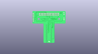
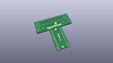
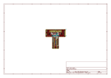
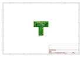
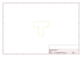
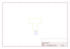
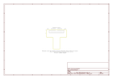

# OOMP Project  
## Pi_Wedge  by sparkfun  
  
oomp key: oomp_projects_flat_sparkfun_pi_wedge  
(snippet of original readme)  
  
**NOTE:** *This product has been retired from our catalog. For the latest version, check out [BOB-13717](https://www.sparkfun.com/products/13717).*  
  
*If you are looking for more up-to-date info, please check out some of these resources to see how other users are still hacking and improving on this version of the product.*  
* *[SparkFun Forum](https://forum.sparkfun.com/)*  
* *[Comments Here on GitHub](https://github.com/sparkfun/Pi_Wedge/issues)*  
* *[IRC Channel](https://www.sparkfun.com/news/263)*  
  
Pi Wedge - Breakout For Raspberry Pi GPIO Connector  
----------------------------  
  
  
  
This is the Pi Wedge, a small board that connects to the Raspberry Pi’s 26-pin GPIO connector, and breaks the pins out to breadboard-friendly arrangement and spacing, and even adds a couple of decoupling capacitors on the power supply lines. The “Wedge” also makes the initial bringup process easier - you can plug an FTDI Basic module into the built-in serial port. Each Pi Wedge comes as an easy to assemble kit that can can be inserted into the Raspberry Pi’s GPIO port that allows you to prototype as soon as you are done soldering.  
  
The kit works with both the [Model A](https://www.sparkfun.com/products/11837) and [Model B](https://www.sparkfun.com/products/11546) versions of the Raspberry Pi.   
  
It adapts the GPIO header on the Pi to a standard solderless breadboard, such as our [  
  full source readme at [readme_src.md](readme_src.md)  
  
source repo at: [https://github.com/sparkfun/Pi_Wedge](https://github.com/sparkfun/Pi_Wedge)  
## Board  
  
  
## Schematic  
  
  
  
[schematic pdf](working_schematic.pdf)  
## Images  
  
  
  
  
  
  
  
  
  
  
  
  
  
  
  
  
