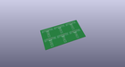
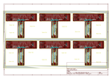
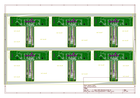
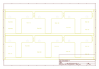
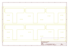
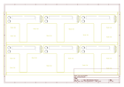

# OOMP Project  
## Pi_Wedge_40-Pin_PreAssembled  by sparkfun  
  
oomp key: oomp_projects_flat_sparkfun_pi_wedge_40_pin_preassembled  
(snippet of original readme)  
  
Pi Wedge 40-Pin PreAssembled - Breakout For 40-Pin, Second Generation Raspberry Pi GPIO Connector.  
----------------------------  
  
  
  
  
[SparkFun Pi Wedge (PreAssembled) [BOB-13717]](https://www.sparkfun.com/products/13717)  
  
This part was created in Eagle v6.5.0.  Software examples were developed using the [WiringPi](wiringpi.com) libraries and utilities.  
  
Repository Contents  
-------------------  
  
* **/Hardware** - All Eagle design files (.brd, .sch, .STL)  
* **/Software** - C source code for SPI, I2C and GPIO examples.  All use [WiringPi](wiringpi.com) for the underlying device interfaces  
* **/Production** - Production panel files (.brd)  
  
Documentation  
--------------  
* **[Hookup Guide](https://learn.sparkfun.com/tutorials/preassembled-40-pin-pi-wedge-hookup-guide)** - Basic hookup guide for the Pi Wedge.  
* **[Raspberry gPIo](https://learn.sparkfun.com/tutorials/raspberry-gpio)** - Programming guide using the Pi's I/O pins with Python and C.   
* **[Raspberry Pi SPI and I2C Tutorial](https://learn.sparkfun.com/tutorials/raspberry-pi-spi-and-i2c-tutorial)** - Programming guide using the Pi's SPI and I2C.  
* **[SparkFun Fritzing repo](https://github.com/sparkfun/Fritzing_Parts)** - Fritzing diagrams for SparkFun products.  
* **[SparkFun 3D Model repo](https://github.com/sparkfun/3D_Models)** - 3D models of SparkFun products.   
* **[SparkFun Graphical Datasheets](ht  
  full source readme at [readme_src.md](readme_src.md)  
  
source repo at: [https://github.com/sparkfun/Pi_Wedge_40-Pin_PreAssembled](https://github.com/sparkfun/Pi_Wedge_40-Pin_PreAssembled)  
## Board  
  
  
## Schematic  
  
  
  
[schematic pdf](working_schematic.pdf)  
## Images  
  
  
  
  
  
  
  
  
  
  
  
  
  
  
  
  
