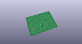
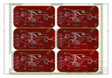
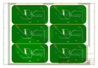
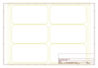
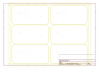
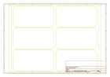
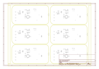

# OOMP Project  
## PicoBoard  by sparkfun  
  
(snippet of original readme)  
  
Picoboard  
=========  
  
[   
*PicoBoard (WIG-10311)*](https://www.sparkfun.com/products/10311)  
  
The PicoBoard allows you to interface hardware sensors with the Scratch programming language.  
  
  
Repository Contents  
-------------------  
* **/hardware** - All Eagle design files (.brd, .sch, .STL)  
* **/firmware** - PicoBoard source code for an ATmega328.  
  
License Information  
-------------------  
The contents released under [Creative Commons Share-alike 3.0](http://creativecommons.org/licenses/by-sa/3.0/).    
  full source readme at [readme_src.md](readme_src.md)  
  
source repo at: [https://github.com/sparkfun/PicoBoard](https://github.com/sparkfun/PicoBoard)  
## Board  
  
  
## Schematic  
  
  
  
[schematic pdf](working_schematic.pdf)  
## Images  
  
  
  
  
  
  
  
  
  
  
  
  
  
  
  
  
