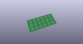
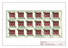
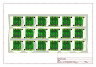
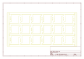
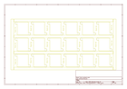
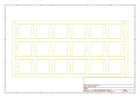
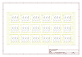

# OOMP Project  
## PicoBuck  by sparkfun  
  
(snippet of original readme)  
  
PicoBuck LED Driver  
===================  
  
[    
*PicoBuck LED Driver (COM-11850)*](https://www.sparkfun.com/products/11850)  
  
This breakout board allows you to control and blend 3 different LEDs on 3 different channels.   
  
Repository Contents  
-------------------  
* **/Hardware** - All Eagle design files (.brd, .sch, .STL)  
* **/Production** - Test bed files and production panel files  
  
License Information  
-------------------  
The hardware is released under [Creative Commons Share-alike 3.0](http://creativecommons.org/licenses/by-sa/3.0/).    
All other code is open source so please feel free to do anything you want with it; you buy me a beer if you use this and we meet someday ([Beerware license](http://en.wikipedia.org/wiki/Beerware)).  
   
 -> This was a collaboration with Ethan Zonca<-  
  
  full source readme at [readme_src.md](readme_src.md)  
  
source repo at: [https://github.com/sparkfun/PicoBuck](https://github.com/sparkfun/PicoBuck)  
## Board  
  
  
## Schematic  
  
  
  
[schematic pdf](working_schematic.pdf)  
## Images  
  
  
  
  
  
  
  
  
  
  
  
  
  
  
  
  
