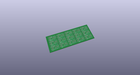
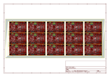
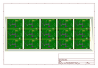
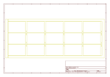
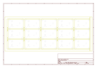
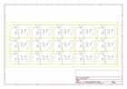

# OOMP Project  
## Pocket_AVR_Programmer  by sparkfun  
  
oomp key: oomp_projects_flat_sparkfun_pocket_avr_programmer  
(snippet of original readme)  
  
Pocket AVR Programmer  
=====================  
  
[    
*Pocket AVR Programmer (PGM-09825)*](https://www.sparkfun.com/products/9825)  
  
This is a simple to use USB AVR programmer, that works with ATmega168 and ATmega328 and should work well  
with all the AVR micros supported by AVRDUDE.  
  
Repository Contents  
-------------------  
* **/Enclosure** - 3D model of enclosure for this (.stl).  
* **/Drivers** - Windows 7 drivers for use with this programmer.   
* **/Firmware** - Firmware that ships on the Pocket AVR Programmer.  
* **/Hardware** - All Eagle design files (.brd, .sch).  
  
Documentation  
--------------  
* **[Hookup Guide](https://learn.sparkfun.com/tutorials/pocket-avr-programmer-hookup-guide)** - Basic hookup guide for the Pocket AVR Programmer.   
* **[Installing an Arduino Bootloader](https://learn.sparkfun.com/tutorials/installing-an-arduino-bootloader)**  - Example of installing an Arduino bootloader on an Atmega328P-based microcontrollers (i.e. Arduino Uno and RedBoard Programmed with Arduino) through the Arduino IDE and command line using avrdude.  
  
License Information  
-------------------  
The hardware is released under [Creative Commons Share-alike 3.0](http://creativecommons.org/licenses/by-sa/3.0/).  
The firmware is based off of:  
* [USBtiny](http://dicks.home.xs4all.nl/avr/usbtiny/index.html) by Dick Streefland  
* [USBtinyISP](http://www.ladyada.net/make/usbtinyisp/) by Limor Fried and is  
  full source readme at [readme_src.md](readme_src.md)  
  
source repo at: [https://github.com/sparkfun/Pocket_AVR_Programmer](https://github.com/sparkfun/Pocket_AVR_Programmer)  
## Board  
  
  
## Schematic  
  
  
  
[schematic pdf](working_schematic.pdf)  
## Images  
  
  
  
  
  
  
  
  
  
  
  
  
  
  
  
  
