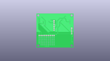
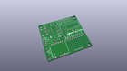
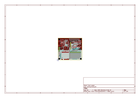
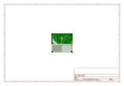
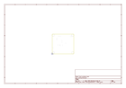
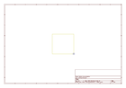
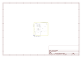

# OOMP Project  
## Polar_Heart_Rate_Monitor_Interface  by sparkfun  
  
(snippet of original readme)  
  
SparkFun Polar Heart Rate Monitor Interface  
========================================  
  
  
  
[*SparkFun Polar Heart Rate Monitor Interface (SEN-08661)*](https://www.sparkfun.com/products/8661)  
  
The Heart Rate Monitor Interface (HRMI) is an intelligent peripheral device that converts the ECG signal from the Polar Heart Rate Monitor (HRM)   
into easy-to-use heart rate data.  
  
Repository Contents  
-------------------  
* **/Hardware** - All Eagle design files (.brd, .sch)  
  
  
License Information  
-------------------  
The hardware is released under [Creative Commons ShareAlike 4.0 International](https://creativecommons.org/licenses/by-sa/4.0/).  
  
This product is a collaboration with Dan Julio. A portion of each sales goes back to them for product support and continued development.  
  
Distributed as-is; no warranty is given.  
  
  full source readme at [readme_src.md](readme_src.md)  
  
source repo at: [https://github.com/sparkfun/Polar_Heart_Rate_Monitor_Interface](https://github.com/sparkfun/Polar_Heart_Rate_Monitor_Interface)  
## Board  
  
  
## Schematic  
  
  
  
[schematic pdf](working_schematic.pdf)  
## Images  
  
  
  
  
  
  
  
  
  
  
  
  
  
  
  
  
