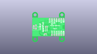
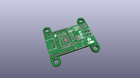
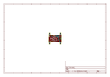
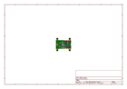
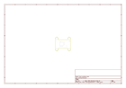
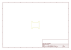
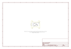

# OOMP Project  
## Power_Delivery_Board-USB-C  by sparkfun  
  
oomp key: oomp_projects_flat_sparkfun_power_delivery_board_usb_c  
(snippet of original readme)  
  
SparkFun Power Delivery Board - USB-C  
========================================  
  
  
  
[*SparkFun Power Delivery Board - USB-C (15801)*](https://www.sparkfun.com/products/15801)  
  
<Basic description of the part.>  
  
Repository Contents  
-------------------  
  
* **/Hardware** - Eagle design files (.brd, .sch)  
  
Documentation  
--------------  
* **[Hookup Guide](https://learn.sparkfun.com/tutorials/power-delivery-board---usb-c-qwiic-hookup-guide)** - Basic hookup guide for the Power Delivery Board - USB-C.  
* **[Arduino Library](https://github.com/sparkfun/SparkFun_STUSB4500_Arduino_Library)** - Arduino Library for use with the Power Delivery Board.  
* **[SparkFun Fritzing repo](https://github.com/sparkfun/Fritzing_Parts)** - Fritzing diagrams for SparkFun products.  
  
License Information  
-------------------  
  
This product is _**open source**_!   
  
Please review the LICENSE.md file for license information.   
  
If you have any questions or concerns on licensing, please contact technical support on our [SparkFun forums](https://forum.sparkfun.com/viewforum.php?f=152).  
  
Distributed as-is; no warranty is given.  
  
- Your friends at SparkFun.  
  
_<COLLABORATION CREDIT>_  
  
  full source readme at [readme_src.md](readme_src.md)  
  
source repo at: [https://github.com/sparkfun/Power_Delivery_Board-USB-C](https://github.com/sparkfun/Power_Delivery_Board-USB-C)  
## Board  
  
  
## Schematic  
  
  
  
[schematic pdf](working_schematic.pdf)  
## Images  
  
  
  
  
  
  
  
  
  
  
  
  
  
  
  
  
