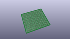
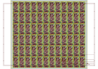
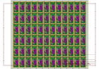
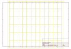
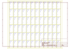
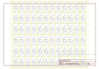

# OOMP Project  
## Pro_Mini_Candy  by sparkfun  
  
oomp key: oomp_projects_flat_sparkfun_pro_mini_candy  
(snippet of original readme)  
  
**NOTE:** *This product has been retired from our catalog as this was for a special promotion. If you are looking for more up-to-date info, please check out some of these resources to see how other users are still hacking, improving, and using on this product with the [Arduino Pro Mini 5V/16MHz](https://www.sparkfun.com/products/11113).*  
* *[SparkFun Forum](https://forum.sparkfun.com/)*  
* *[IRC Channel](https://www.sparkfun.com/news/263)*  
  
SparkFun Pro Mini Candy  
===============  
  
  
  
[*SparkFun  Pro Mini Candy (DEV-12627)*](https://www.sparkfun.com/products/retired/12627)  
  
  
This is a repository for the special SparkFun version of the Arduino Pro Mini 5V/16 MHz board.  
  
It is designed to be used as a complimentary board to send out with holiday orders. Check out the special regarding this [here](https://www.sparkfun.com/news/1334).  
  
Repository Contents  
-------------------  
  
* **/Firmware** - Example code   
* **/Hardware** - Eagle design files (.brd, .sch)  
* **/Production** - Production panel files (.brd)  
  
Documentation  
--------------  
  
* **[Hookup Guide](https://learn.sparkfun.com/tutorials/using-the-arduino-pro-mini-33v)** - Basic hookup guide for the Arduino Pro Mini 3.3V/8MHz. It can be used as a guide with the 5V. The only difference when following the tutorial is selecting the board definition in the Arduino IDE and the voltage levels.  
* **[Limited Edition Christmas Candy Pro Mini](https://w  
  full source readme at [readme_src.md](readme_src.md)  
  
source repo at: [https://github.com/sparkfun/Pro_Mini_Candy](https://github.com/sparkfun/Pro_Mini_Candy)  
## Board  
  
  
## Schematic  
  
  
  
[schematic pdf](working_schematic.pdf)  
## Images  
  
  
  
  
  
  
  
  
  
  
  
  
  
  
  
  
