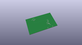
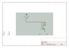
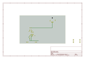
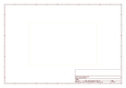
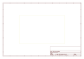
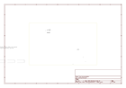

# OOMP Project  
## Proto_Pedal  by sparkfun  
  
oomp key: oomp_projects_flat_sparkfun_proto_pedal  
(snippet of original readme)  
  
SparkFun Proto Pedal  
========================================  
  
  
  
[*SparkFun Proto Pedal*](https://www.sparkfun.com/products/13124)  
  
[*SparkFun Proto Pedal Chassis*](https://www.sparkfun.com/products/13967)  
  
The SparkFun Proto Pedal is breatboard featuring prewired I/O boilerplate for building guitar stompboxes.  We also offer a matching predrilled chassis.  
  
_**If you're looking for the Teensy Project Sketches**_ [they're here](https://github.com/sparkfun/Proto_Pedal/tree/master/projects/teensy-based).  Please remember to check the individual sketches for further notes and details in their respective `README.md` files.  
  
Repository Contents  
-------------------  
  
* **/Hardware** - Eagle design files (.brd, .sch)  
* **/Mechanical** - Enclosure files and related information  
* **/Production** - Production panel files (.brd)  
* **/Projects** - Example circuits build on the Proto Pedal <PRODUCT NAME>  
  
Documentation  
--------------  
* **[Proto Pedal Assembly and Theory Guide](https://learn.sparkfun.com/tutorials/proto-pedal-assembly-and-theory-guide)** - Information to help get started.  
* **[Chassis Hookup Guide](https://learn.sparkfun.com/tutorials/proto-pedal-chassis-hookup-guide)** - Drilling and painting the enclosure.  
* **[Analog Equalizer Project](https://learn.sparkfun.com/tutorials/proto-pedal-example-analog-equalizer-project)** - the gyrator based two-band EQ example.  
* **[Teensy-Audio based Prog  
  full source readme at [readme_src.md](readme_src.md)  
  
source repo at: [https://github.com/sparkfun/Proto_Pedal](https://github.com/sparkfun/Proto_Pedal)  
## Board  
  
  
## Schematic  
  
  
  
[schematic pdf](working_schematic.pdf)  
## Images  
  
  
  
  
  
  
  
  
  
  
  
  
  
  
  
  
