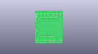
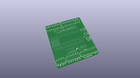
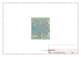
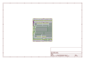
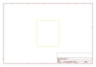
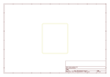
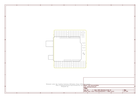

# OOMP Project  
## ProtoScrewShield  by sparkfun  
  
oomp key: oomp_projects_flat_sparkfun_protoscrewshield  
(snippet of original readme)  
  
 ProtoScrewShield  
========================================  
  
  
  
[*ProtoScrewShield (DEV-09729)*](https://www.sparkfun.com/products/9729)  
  
The ScrewShield extends all pins of the Arduino out to 3.5mm pitch screw terminals.   
It also has a lot of the utility provided by Arduino Protoshield, including: a large prototyping space of both connected and unconnected 0.1" spaced through-holes, a couple 5V and GND busses, a reset button, general use push button, and a 5mm yellow LED.  
  
Repository Contents  
-------------------  
  
* **/Hardware** - Eagle design files (.brd, .sch)  
* **/Production** - Production panel files (.brd)  
  
Documentation  
--------------  
* **[SparkFun Fritzing repo](https://github.com/sparkfun/Fritzing_Parts)** - Fritzing diagrams for SparkFun products.  
* **[SparkFun 3D Model repo](https://github.com/sparkfun/3D_Models)** - 3D models of SparkFun products.   
  
  
License Information  
-------------------  
This product is _**open source**_!   
  
The **hardware** is released under [Creative Commons ShareAlike 4.0 International](https://creativecommons.org/licenses/by-sa/4.0/).  
  
Please use, reuse, and modify these files as you see fit. Please maintain attribution to SparkFun Electronics and release anything derivative under the same license.  
  
Distributed as-is; no warranty is given.  
  
- Your friends at SparkFun.  
  
_**Note:**  This product is a collaboration with Tod Kurt, John Edgar Park, and Brian Jepson o  
  full source readme at [readme_src.md](readme_src.md)  
  
source repo at: [https://github.com/sparkfun/ProtoScrewShield](https://github.com/sparkfun/ProtoScrewShield)  
## Board  
  
  
## Schematic  
  
  
  
[schematic pdf](working_schematic.pdf)  
## Images  
  
  
  
  
  
  
  
  
  
  
  
  
  
  
  
  
