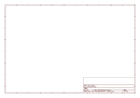
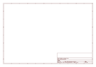

# OOMP Project  
## ProtoSnap-Pro_Mini  by sparkfun  
  
oomp key: oomp_projects_flat_sparkfun_protosnap_pro_mini  
(snippet of original readme)  
  
**_NOTE: This product has been retired from our catalog. This information is made available for those who are curious._**  
  
  
ProtoSnap Pro-Mini  
===================  
  
[  
*ProtoSnap Pro Mini (DEV-10889)*](https://www.sparkfun.com/products/10889)  
  
The ProtoSnap is an Arduino-compatible development platform aimed at teach the basics of Arduino programming as efficiently as possible.  
  
Repository Contents  
-------------------  
* **/Hardware** - All Eagle design files (.brd, .sch)  
* **/Production** - Test bed files and production panel files  
  
Product Versions  
----------------  
* [DEV-10889](https://www.sparkfun.com/products/10889)- Standard ProtoSnap Pro Mini  
* [RTL-11053] (https://www.sparkfun.com/products/11053)- Retail version of ProtoSnap Pro Mini  
  
License Information  
-------------------  
The hardware is released under [Creative Commons ShareAlike 4.0 International](https://creativecommons.org/licenses/by-sa/4.0/).  
The code is beerware; if you see me (or any other SparkFun employee) at the local, and you've found our code helpful, please buy us a round!  
  
Distributed as-is; no warranty is given.  
  
  full source readme at [readme_src.md](readme_src.md)  
  
source repo at: [https://github.com/sparkfun/ProtoSnap-Pro_Mini](https://github.com/sparkfun/ProtoSnap-Pro_Mini)  
## Board  
  
  
## Schematic  
  
  
  
[schematic pdf](working_schematic.pdf)  
## Images  
  
  
  
  
  
  
  
  
  
  
  
  
  
  
  
  
