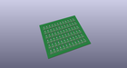
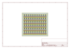
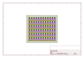
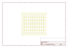
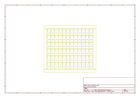
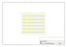

# OOMP Project  
## QRE1113_Line_Sensor-Analog  by sparkfun  
  
oomp key: oomp_projects_flat_sparkfun_qre1113_line_sensor_analog  
(snippet of original readme)  
  
QRE1113 Line Sensor Breakout Board - Analog  
===========================================  
  
[  
*QRE1113 Line Sensor Breakout Board -Analog (ROB-09453)*](https://www.sparkfun.com/products/9453)  
  
This is a breakout board for the QRE1113 sensor,   
with an easy-to-use analog output, varying depending on the amount of IR light reflect back to the sensor.  
This sensor can be used in both 3.3V and 5V systems.   
  
  
Repository Contents  
-------------------  
  
* **/Hardware** - All Eagle design files (.brd, .sch, .STL)  
* **/Production** - Test bed files and production panel files  
  
License Information  
-------------------  
The hardware is released under [Creative Commons ShareAlike 4.0 International](https://creativecommons.org/licenses/by-sa/4.0/).  
  
Distributed as-is; no warranty is given.  
  
  full source readme at [readme_src.md](readme_src.md)  
  
source repo at: [https://github.com/sparkfun/QRE1113_Line_Sensor-Analog](https://github.com/sparkfun/QRE1113_Line_Sensor-Analog)  
## Board  
  
  
## Schematic  
  
  
  
[schematic pdf](working_schematic.pdf)  
## Images  
  
  
  
  
  
  
  
  
  
  
  
  
  
  
  
  
