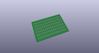
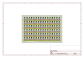
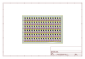
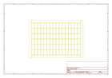
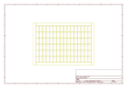
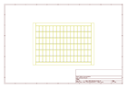
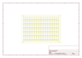

# OOMP Project  
## QRE1113_Line_Sensor_Breakout-Digital  by sparkfun  
  
oomp key: oomp_projects_flat_sparkfun_qre1113_line_sensor_breakout_digital  
(snippet of original readme)  
  
SparkFun Line Sensor Breakout - QRE1113 (Digital)  
========================================  
  
  
  
[*SparkFun Line Sensor Breakout - QRE1113 (Digital) (ROB-09454)*](https://www.sparkfun.com/products/9454)  
  
This version of the QRE1113 breakout board features a digital output, using a capacitor discharge circuit to measure the amount of reflection.   
This tiny board is perfect for line sensing when only digital I/O is available, and can be used in both 3.3V and 5V systems.  
  
Repository Contents  
-------------------  
  
* **/Hardware** - Eagle design files (.brd, .sch)  
* **/Production** - Production panel files (.brd)  
  
  
Documentation  
--------------  
* **[SparkFun Fritzing repo](https://github.com/sparkfun/Fritzing_Parts)** - Fritzing diagrams for SparkFun products.  
* **[SparkFun 3D Model repo](https://github.com/sparkfun/3D_Models)** - 3D models of SparkFun products.   
  
Product Versions  
----------------  
* [ROB-09454](https://www.sparkfun.com/products/9454)- Digital version of the breakout board.   
* [ROB-09453] (https://www.sparkfun.com/products/9453)- Analog version of the breakout board.   
  
  
License Information  
-------------------  
This product is _**open source**_!   
  
The **hardware** is released under [Creative Commons ShareAlike 4.0 International](https://creativecommons.org/licenses/by-sa/4.0/).  
  
  
Please use, reuse, and modify these files as you see fit. Please maintain attribu  
  full source readme at [readme_src.md](readme_src.md)  
  
source repo at: [https://github.com/sparkfun/QRE1113_Line_Sensor_Breakout-Digital](https://github.com/sparkfun/QRE1113_Line_Sensor_Breakout-Digital)  
## Board  
  
  
## Schematic  
  
  
  
[schematic pdf](working_schematic.pdf)  
## Images  
  
  
  
  
  
  
  
  
  
  
  
  
  
  
  
  
