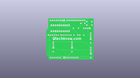
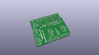
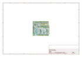
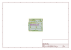
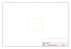
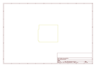
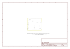

# OOMP Project  
## Qtechknow_ArduSensor_Learning_Kit  by sparkfun  
  
oomp key: oomp_projects_flat_sparkfun_qtechknow_ardusensor_learning_kit  
(snippet of original readme)  
  
Qtechknow ArduSensor Learning Kit  
=================================  
  
[  
*Qtechknow ArduSensor Learning Kit(11470)*](https://www.sparkfun.com/products/11470)  
  
  
Repository Contents  
-------------------  
  
* **/ArduSensor PCB** - All  design files for the ArduSensor PCB.   
* **/ArduSensor Shield** - All design files for the ArduSensor Shield that is Uno-footprint compatible.   
  
  
License Information  
-------------------  
The hardware is released under [Creative Commons ShareAlike 4.0 International](https://creativecommons.org/licenses/by-sa/4.0/).  
  
  
->This product is a collaboration with Quin at Qtechknow.com.   
You can find additional resources on these products [here](http://learn.qtechknow.com/)<-  
  full source readme at [readme_src.md](readme_src.md)  
  
source repo at: [https://github.com/sparkfun/Qtechknow_ArduSensor_Learning_Kit](https://github.com/sparkfun/Qtechknow_ArduSensor_Learning_Kit)  
## Board  
  
  
## Schematic  
  
  
  
[schematic pdf](working_schematic.pdf)  
## Images  
  
  
  
  
  
  
  
  
  
  
  
  
  
  
  
  
