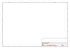

# OOMP Project  
## Quadstepper_Motor_Driver  by sparkfun  
  
(snippet of original readme)  
  
SparkFun QuadStepper Motor Driver  
=================================  
  
  
[*SparkFun Quadstepper Motor Driver (ROB-10507)*](https://www.sparkfun.com/products/10507)  
  
The Quadstepper motor driver board allows you to control up to 4 bipolar stepper motors simultaneously using logic level IO pins.   
Each motor driver has an output drive capacity of 35V and 1Amps. The board is capable of driving motors in full, half, quarter, eight,   
and sixteenth-step modes. The logic levels are selectable between 3.3V and 5V by way of a jumper. The bus header allows you to control   
all four motors with only 6 IO pins by controlling the enable (EN pins) for each motor, although each motor will be activated alone, not simultaneously.   
Be sure to close all of the ‘Bus Enable’ jumpers on the back of the board in order to use the Bus header.  
  
Repository Contents  
-------------------  
* **/Hardware** - All Eagle design files (.brd, .sch, .STL)  
* **/Libraries** - All Arduino libraries and board examples  
  
  
License Information  
-------------------  
The hardware is released under [Creative Commons ShareAlike 4.0 International](https://creativecommons.org/licenses/by-sa/4.0/).  
The code is beerware; if you see me (or any other SparkFun employee) at the local, and you've found our code helpful, please buy us a round!  
  
Distributed as-is; no warranty is given.  
  
  full source readme at [readme_src.md](readme_src.md)  
  
source repo at: [https://github.com/sparkfun/Quadstepper_Motor_Driver](https://github.com/sparkfun/Quadstepper_Motor_Driver)  
## Board  
  
  
## Schematic  
  
  
  
[schematic pdf](working_schematic.pdf)  
## Images  
  
  
  
  
  
  
  
  
  
  
  
  
  
  
  
  
