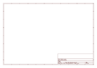
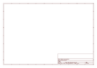

# OOMP Project  
## Qwiic_Atmospheric_Sensor_Breakout_BME280  by sparkfun  
  
(snippet of original readme)  
  
SparkFun Atmospheric Sensor Breakout - BME280 (Qwiic)  
========================================  
  
  
  
[*SparkFun Atmospheric Sensor Breakout - BME280 (Qwiic) (SEN-15440)*](https://www.sparkfun.com/products/15440)  
  
The SparkFun Atmospheric Sensor Breakout - BME280 (Qwiic) is perfect for sensing basic weather information. Using I2C, you can easily read data from the on-board BME280 sensor. This includes temperature, pressure, altitude and humidity.  
  
Repository Contents  
-------------------  
* **/Hardware** - Eagle design files (.brd, .sch)  
* **/Production** - Production panel files (.brd)  
  
Documentation  
--------------  
* **[Arduino Library](https://github.com/sparkfun/SparkFun_BME280_Arduino_Library/)** - Arduino library for the BME280.  
* **[Python Library](https://github.com/sparkfun/Qwiic_BME280_Py)** - Python library for the BME280.  
* **[Hookup Guide](https://learn.sparkfun.com/tutorials/qwiic-atmospheric-sensor-bme280-hookup-guide)** - Basic hookup guide for the SparkFun Atmospheric Sensor Breakout - BME280 (Qwiic).  
* **[Qwiic Ecosystem](https://www.sparkfun.com/qwiic)** - Qwiic enabled for fast prototyping!  
  
Product Versions  
----------------  
* [SEN-13676](https://www.sparkfun.com/products/13676)- SparkFun Atmospheric Sensor Breakout - BME280  
* [SEN-15440](https://www.sparkfun.com/products/15440)- SparkFun Atmo  
  full source readme at [readme_src.md](readme_src.md)  
  
source repo at: [https://github.com/sparkfun/Qwiic_Atmospheric_Sensor_Breakout_BME280](https://github.com/sparkfun/Qwiic_Atmospheric_Sensor_Breakout_BME280)  
## Board  
  
  
## Schematic  
  
  
  
[schematic pdf](working_schematic.pdf)  
## Images  
  
  
  
  
  
  
  
  
  
  
  
  
  
  
  
  
