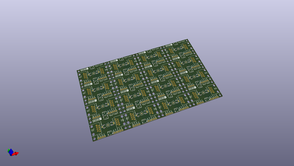
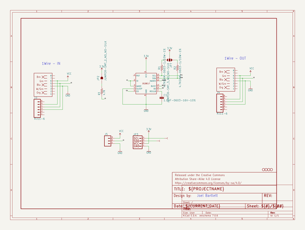
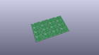
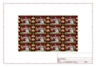
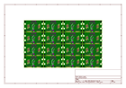
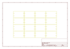
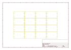
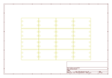
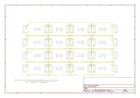

# OOMP Project  
## 1Wire_to_Qwiic_Bridge_DS28E17  by sparkfunX  
  
(snippet of original readme)  
  
- Qwiic_1Wire_to_I2C_Bridge_DS28E17  
A 1Wire-to- I2C bridge for extending the length of wired I2C networks. For Qwiic Ecosystem.   
  
  full source readme at [readme_src.md](readme_src.md)  
  
source repo at: [https://github.com/sparkfunX/1Wire_to_Qwiic_Bridge_DS28E17](https://github.com/sparkfunX/1Wire_to_Qwiic_Bridge_DS28E17)  
## Board  
  
  
## Schematic  
  
  
  
[schematic pdf](working_schematic.pdf)  
## Images  
  
  
  
  
  
  
  
  
  
  
  
  
  
  
  
  
