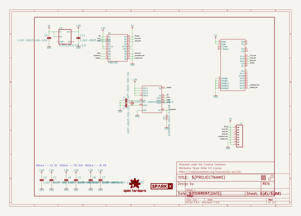

# OOMP Project  
## A111_Pulsed_Radar_Breakout  by sparkfunX  
  
oomp key: oomp_projects_flat_sparkfunx_a111_pulsed_radar_breakout  
(snippet of original readme)  
  
SparkX A111 Pulsed Radar Breakout  
========================================  
  
  
  
[*SparkX  A111 Pulsed Radar Breakout (SPX-14811)*](https://www.sparkfun.com/products/14811)  
  
Does your project require high-precision, cutting-edge distance measurement? Or maybe speed-, motion-, or gesture-sensing? We’re not talking about simple ultrasonic, or even infrared, sensors here, but 60GHz radar! Well say hello to our tiny, pulsed-radar friend: the Acconeer A111.  
  
The A111 is a single-chip solution for pulsed coherent radar (PCR). It comes complete with integrated antennae and an SPI interface capable of clock speeds of up to 50MHz. The A111’s primary use case is distance-sensing, but it also supports applications in gesture-, motion-, material-, and speed-detection. It can see objects at distances of up to two meters.  
  
Our breakout board for the A111 includes a 1.8V regulator, voltage-level translation between 1.8V and either 3.3V or 5V, and, of course, it breaks out all pins of the pulsed radar sensor to both 0.1-inch and Raspberry Pi-friendly headers.  
  
The breakout board is primarily **designed to interface directly with a Raspberry Pi** – Acconeer’s SDK currently only supports ARMv7’s (e.g. a Pi) and ARM Cortex-M4’s. Check out our <a href="https://learn.sparkfun.com/tutorials/using-the-a111-pulsed-radar-sensor-with-a-ra  
  full source readme at [readme_src.md](readme_src.md)  
  
source repo at: [https://github.com/sparkfunX/A111_Pulsed_Radar_Breakout](https://github.com/sparkfunX/A111_Pulsed_Radar_Breakout)  
## Board  
  
  
## Schematic  
  
  
  
[schematic pdf](working_schematic.pdf)  
## Images  
  
  
  
  
  
  
  
  
  
  
  
  
  
  
  
  
