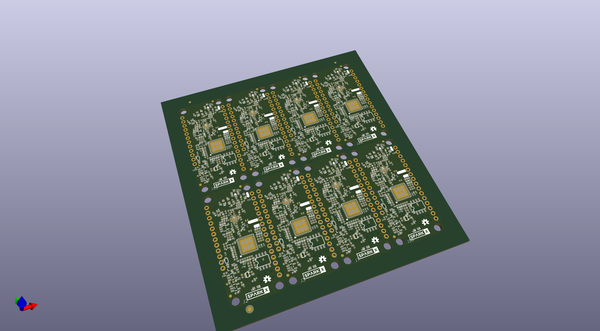
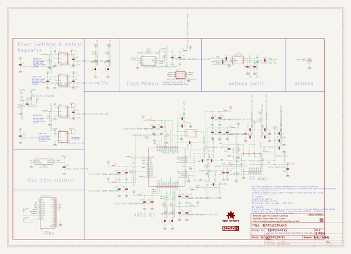
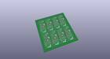
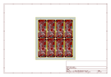
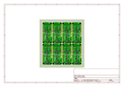
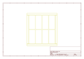
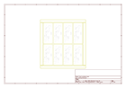
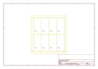
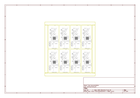

# OOMP Project  
## ARGOS-ARTIC-R2-Shield  by sparkfunX  
  
oomp key: oomp_projects_flat_sparkfunx_argos_artic_r2_shield  
(snippet of original readme)  
  
- ARGOS Satellite Transceiver Shield  
  
The [ARGOS ARTIC R2 satellite communication chipset](https://www.cls-telemetry.com/argos-solutions/argos-products/modems/artic-chipset/-1534863095666-398318f3-c367) in Thing Plus format.  
  
  
  
[*SparkX ARGOS Satellite Transceiver Shield (SPX-17236)*](https://www.sparkfun.com/products/17236)  
  
_Dimensions are in inches_    
  
The ARTIC-R2 is an integrated low power small size ARGOS 2/3/4 single chip radio. ARTIC-R2 implements a message based wireless interface. For satellite uplink communication, ARTIC-R2 will encode, modulate and transmit provided user messages. For downlink communication, ARTIC-R2 will lock to the downstream, demodulate and decode it and extract the satellite messages.  
  
The ARTIC-R2 can transmit signals in frequency bands around 400MHz and receive signals in the bands around 466MHz, in accordance with the ARGOS satellite system specifications. The ARTIC-R2 is compliant to all ARGOS 3 and ARGOS 4 RX and TX standards. It contains a RF transceiver and frequency synthesizer and a digital baseband modem. The ARTIC-R2 contains an on-chip power amplifier delivering 1mW [0dBm] output power, that serves as an output for connecting an external high efficient PA. The (de)modulation algorithms run on an on-chip DSP. This software approach   
  full source readme at [readme_src.md](readme_src.md)  
  
source repo at: [https://github.com/sparkfunX/ARGOS-ARTIC-R2-Shield](https://github.com/sparkfunX/ARGOS-ARTIC-R2-Shield)  
## Board  
  
  
## Schematic  
  
  
  
[schematic pdf](working_schematic.pdf)  
## Images  
  
  
  
  
  
  
  
  
  
  
  
  
  
  
  
  
