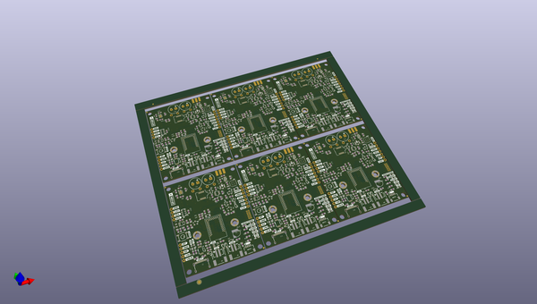

# OOMP Project  
## Artemis_Global_Tracker  by sparkfunX  
  
oomp key: oomp_projects_flat_sparkfunx_artemis_global_tracker  
(snippet of original readme)  
  
- Artemis Global Tracker  
  
An open source global satellite tracker utilising the [SparkFun Artemis module](https://www.sparkfun.com/products/15484),  
[Iridium 9603N satellite transceiver](https://www.iridium.com/products/iridium-9603/) and [u-blox ZOE-M8Q GNSS](https://www.u-blox.com/en/product/zoe-m8-series).  
  
  
  
[*SparkX Artemis Global Tracker (SPX-16469)*](https://www.sparkfun.com/products/16469)  
  
  
  
[*SparkX Artemis Global Tracker (SPX-16469)*](https://www.sparkfun.com/products/16469)  
  
-- Retired Product  
  
The SparkX Artemis Global Tracker (SPX-16469) has been replaced by the [SparkFun Artemis Global Tracker (WRL-18712)](https://www.sparkfun.com/products/18712).  
  
-- Repository Contents  
  
- **/Documentation** - Documentation for the hardware and the full GlobalTracker example  
- **/Hardware** - Eagle PCB, SCH and LBR design files  
- **/Software** - Arduino examples  
- **/Tools** - Tools to help: configure the full GlobalTracker example via USB or remotely via Iridium messaging; and track and map its position  
- **/binaries** - binary files for the examples which you can upload using the [Artemis Firmware Upload GUI](https://github.com/sparkfun/Artemis-Firmware-Upload-GUI) instead of the Arduino IDE  
- **LICENSE.md** contains the lic  
  full source readme at [readme_src.md](readme_src.md)  
  
source repo at: [https://github.com/sparkfunX/Artemis_Global_Tracker](https://github.com/sparkfunX/Artemis_Global_Tracker)  
## Board  
  
  
## Schematic  
  
  
  
[schematic pdf](working_schematic.pdf)  
## Images  
