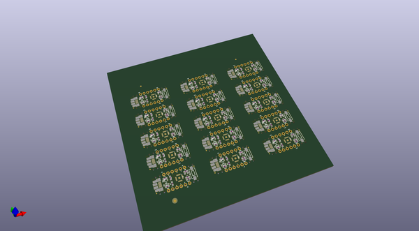
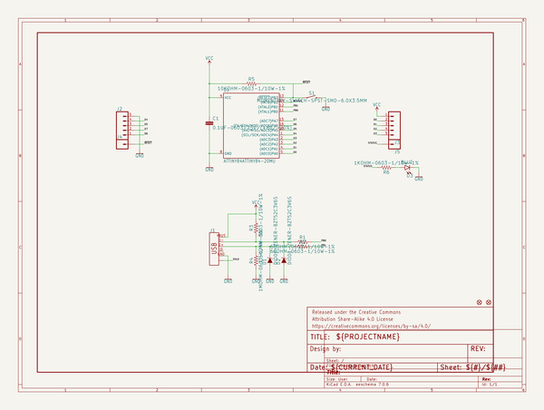
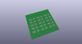
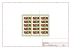
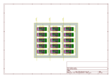
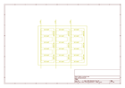
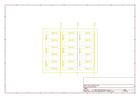
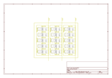

# OOMP Project  
## Atto84  by sparkfunX  
  
(snippet of original readme)  
  
- SparkX Atto84  
  
The Atto84 is an Arduino compatible ATtiny84 breakout pre-programmed with the [Micronucleus V-USB bootloader](https://github.com/micronucleus/micronucleus). The Atto84 Arduino board profile is built around v1.1.5 of SpenceKonde's excellent [ATTinyCore](https://github.com/SpenceKonde/ATTinyCore).   
    
You can buy one [here](https://sparkle.sparkfun.com/sparkle/storefront_products/14804)!  
  
  
  
  
Documentation  
--------------  
* **[Hookup Guide](https://learn.sparkfun.com/tutorials/atto84-hookup-guide)** - Basic hookup guide for the Atto84.  
  
License Information  
-------------------  
  
This product is _**open source**_!   
  
Please review the LICENSE.md file for license information.   
  
If you have any questions or concerns on licensing, please contact techsupport@sparkfun.com.  
  
Distributed as-is; no warranty is given.  
  
- Your friends at SparkFun.  
  
  full source readme at [readme_src.md](readme_src.md)  
  
source repo at: [https://github.com/sparkfunX/Atto84](https://github.com/sparkfunX/Atto84)  
## Board  
  
  
## Schematic  
  
  
  
[schematic pdf](working_schematic.pdf)  
## Images  
  
  
  
  
  
  
  
  
  
  
  
  
  
  
  
  
