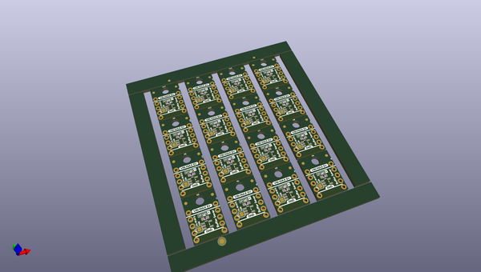
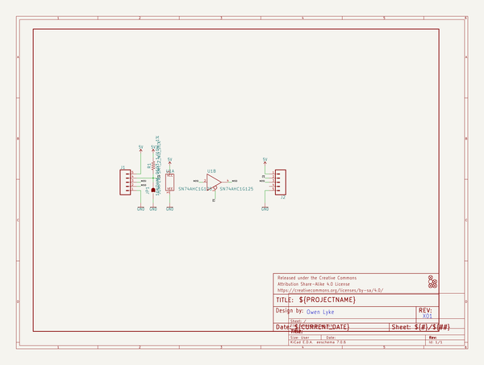
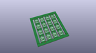
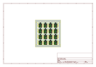
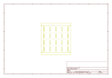
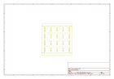
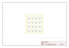

# OOMP Project  
## BufferSaver  by sparkfunX  
  
(snippet of original readme)  
  
SparkX SPI Buffer Saver  
========================================  
  
  
  
[*SPI Buffer Saver (SPX-14973)*](https://www.sparkfun.com/products/14973)  
  
The SPI Buffer Saver increases the speed at which you can refresh SPI data without having to modify the Arduino core libraries. It works by rerouting the MOSI channel onto the MISO channel when the chip select pin is active using a tri-state buffer.  
The same method can be used to switch other signals so take a peek at the schematic and try it out yourself!  
  
SparkFun labored with love to create this code. Feel like supporting open source hardware?   
Buy a [board](https://www.sparkfun.com/products/14973) from SparkFun!  
  
Repository Contents  
-------------------  
  
* **/Documents** - Datasheets  
* **/Hardware** - Eagle design files (.brd, .sch)  
  
Library  
--------------  
* **[Arduino Library](https://github.com/sparkfun/SparkFun_LPS25HB_Arduino_Library)** - Library for reading pressure and changing sensor settings  
  
License Information  
-------------------  
  
This product is _**open source**_!   
  
If you have any questions or concerns on licensing, please contact techsupport@sparkfun.com.  
  
Please use, reuse, and modify these files as you see fit. Please maintain attribution to SparkFun Electronics and release any derivative under the same license.  
  
Distributed as-is; no warranty is given.  
  
- Your friends at SparkFun.  
  
  full source readme at [readme_src.md](readme_src.md)  
  
source repo at: [https://github.com/sparkfunX/BufferSaver](https://github.com/sparkfunX/BufferSaver)  
## Board  
  
  
## Schematic  
  
  
  
[schematic pdf](working_schematic.pdf)  
## Images  
  
  
  
  
  
  
  
  
  
  
  
  
  
  
  
  
