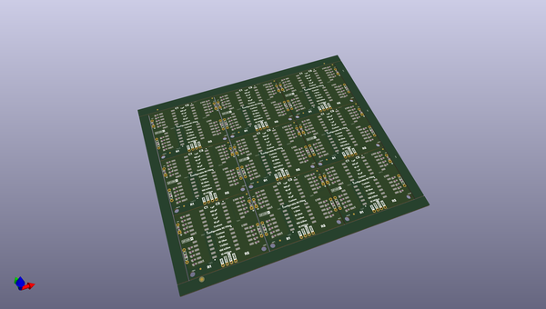

# OOMP Project  
## Configurable_RC_Filter  by sparkfunX  
  
(snippet of original readme)  
  
SparkX Configurable RC Filter  
===================================================================  
  
  
  
[*SparkX Configurable RC Filter (SPX-16392)*](https://www.sparkfun.com/products/16392)  
  
A DIP selectable RC Filter.  
  
Repository Contents  
-------------------  
  
* **/Documents** - Contains schematic .pdf  
* **/Hardware** - Current .brd and .sch files for product  
  
License Information  
-------------------  
  
This product is _**open source**_!  
  
Please review the LICENSE.md file for license information.  
  
If you have any questions or concerns on licensing, please contact technical support on our [SparkFun forums] (https://forum.sparkfun.com/viewforum.php?f=152).  
  
Distributed as-is; no warranty is given.  
  
- Your friends at SparkFun.  
  
_<COLLABORATION CREDIT>_  
  
  full source readme at [readme_src.md](readme_src.md)  
  
source repo at: [https://github.com/sparkfunX/Configurable_RC_Filter](https://github.com/sparkfunX/Configurable_RC_Filter)  
## Board  
  
  
## Schematic  
  
  
  
[schematic pdf](working_schematic.pdf)  
## Images  
