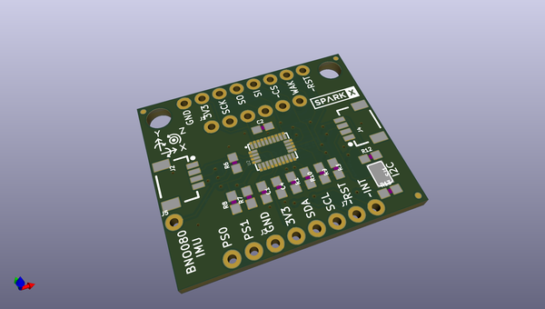

# OOMP Project  
## Desktop-PickAndPlace-CHMT36VA  by sparkfunX  
  
oomp key: oomp_projects_flat_sparkfunx_desktop_pickandplace_chmt36va  
(snippet of original readme)  
  
SparkFun Charm High Desktop Pick and Place  
========================================  
  
  
  
The CHMT36VA is a $2800 desktop sized pick and place machine from Charm High. We use it to produce a variety of designs, 50 to 100pcs at a shot. It works very well for low-volume high-mix pick and place of 0603 based designs.  
  
The main purposed of this repo is the [Eagle Conversion ULP](https://github.com/sparkfunX/Desktop-PickAndPlace-CHMT36VA/tree/master/Eagle-Conversion) and the English Language file. The Conversion ULP offers the user a GUI that looks like this:  
  
  
  
This allows the user to take in an Eagle BRD file and output the recipe file that the CHMT36VA expects. This cuts down on setup time of the machine dramatically.  
  
The [English Language conversion file](https://github.com/sparkfunX/Desktop-PickAndPlace-CHMT36VA/tree/master/Language-File) is our translation and typo fixes of the Charm High provided english file.  
  
Do you have one of these machines? Want to share your tips and tricks and ask other owners a question? Join the [Desktop Pick and Place google group](https://groups.google.com/d/forum/desktop-pick-and-place)!  
  
Be sure to checkout our posts on the machine:  
  
* [Unboxing](https://www.sparkfun.com/sparkx/blog/2586)  
* [Leader Cheaters](ht  
  full source readme at [readme_src.md](readme_src.md)  
  
source repo at: [https://github.com/sparkfunX/Desktop-PickAndPlace-CHMT36VA](https://github.com/sparkfunX/Desktop-PickAndPlace-CHMT36VA)  
## Board  
  
  
## Schematic  
  
  
  
[schematic pdf](working_schematic.pdf)  
## Images  
