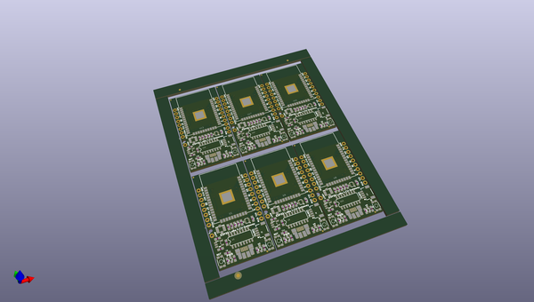

# OOMP Project  
## ESP32_LoRa_1CH_Gateway  by sparkfunX  
  
(snippet of original readme)  
  
SparkX ESP32 LoRa Single-Channel Gateway  
========================================  
  
This repo is the original SparkX version. Please see the [SparkFun repo](https://github.com/sparkfun/ESP32_LoRa_1Ch_Gateway/) for the latest and greatest.  
  
  
  
[*SparkX  ESP32 LoRa Single-Channel Gateway (SPX-14893)*](https://www.sparkfun.com/products/14893)  
  
The SparkX ESP32 LoRa Single-Channel Gateway combines an ESP32 -- a programmable microcontroller featuring both WiFi and Bluetooth radios -- with an RFM95W LoRa transceiver to create a single-channel LoRa gateway. It's a perfect, low-cost tool for monitoring a dozen-or-so LoRa devices, and relaying their messages up to the cloud.  
  
Complete with a [Qwiic connector](https://www.sparkfun.com/qwiic) and a breadboard-compatible array of ESP32 pin-breakouts, this board can can also serve as a general-purpose ESP32/RFM95W development platform. So, instead of using it as a LoRaWAN gateway, you can turn it into a **LoRa device**, and use the powerful ESP32 microcontroller to monitor sensors, host a web server, run a display or more.  
  
These boards are a great way to begin dipping your toes into the world of LoRa and LoRaWAN. Not only can they be programmed as versatile single-channel gateway, but they can also be used as a LoRa device, or a general ESP32/RFM95W development boa  
  full source readme at [readme_src.md](readme_src.md)  
  
source repo at: [https://github.com/sparkfunX/ESP32_LoRa_1CH_Gateway](https://github.com/sparkfunX/ESP32_LoRa_1CH_Gateway)  
## Board  
  
  
## Schematic  
  
  
  
[schematic pdf](working_schematic.pdf)  
## Images  
