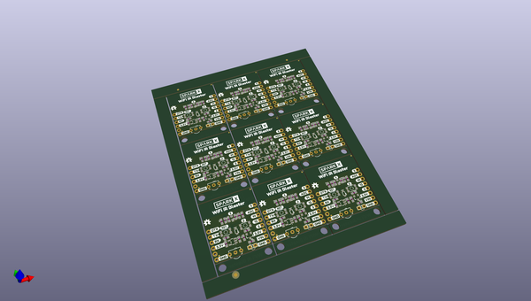

# OOMP Project  
## ESP8266_WiFi_IR_Blaster  by sparkfunX  
  
(snippet of original readme)  
  
SparkX ESP8266 WiFi IR Blaster  
========================================  
  
  
  
[*SparkX  ESP8266 WiFi IR Blaster (SPX-15000)*](https://www.sparkfun.com/products/15000)  
  
The WiFi IR Blaster is designed to connect all of your old, legacy IR-controlled devices to a WiFi network -- exposing them to a new method of control. Want to control your TV via a web-browser? Want to ask Alexa to mute your stereo? Want to schedule triggers to your IR-controlled LED strip? These are all applications that the WiFi IR Blaster is perfect for.  
  
The WiFi IR Blaster combines an ESP8266 -- a powerful WiFi/microcontroller SoC -- with an IR emitter and receiver. With built-in WiFi support, the ESP8266 can be programmed to provide an interface between HTTP, MQTT, TCP, and UDP services and infrared-controlled devices.  
  
This product includes the WiFi IR Blaster, a [Lite-ON LTE-302](https://www.sparkfun.com/datasheets/Components/LTE-302.pdf) infrared emitter, and a [TSOP38238 IR receiver](https://www.sparkfun.com/products/10266). The IR emitter and detector are not populated on the board -- allowing you to assemble them in any orientation your project requires.  
  
For help getting started, check out our [WiFi IR Blaster Hookup Guide](https://learn.sparkfun.com/tutorials/wifi-ir-blaster-hookup-guide), which explains how to assemble the board, program it, and   
  full source readme at [readme_src.md](readme_src.md)  
  
source repo at: [https://github.com/sparkfunX/ESP8266_WiFi_IR_Blaster](https://github.com/sparkfunX/ESP8266_WiFi_IR_Blaster)  
## Board  
  
  
## Schematic  
  
  
  
[schematic pdf](working_schematic.pdf)  
## Images  
