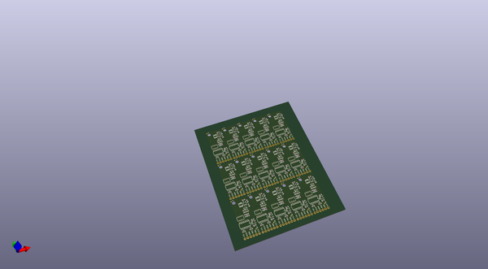

# OOMP Project  
## Flexible_Grayscale_OLED  by sparkfunX  
  
oomp key: oomp_projects_flat_sparkfunx_flexible_grayscale_oled  
(snippet of original readme)  
  
SparkFun Carrier Board for Flexible Grayscale OLED Display  
========================================  
  
  
  
[*SparkFun Flexible Grayscale Display - 1.81" (SPX-14543)*](https://www.sparkfun.com/products/14543)  
  
This is a small flexible, grayscale OLED display. That’s right, we said flexible. We’ve been hearing about flexible displays for years, it’s finally here! You can’t fold it like paper but this OLED from Wisechip can be bent to a 40mm radius without damage. The display is than 0.5mm thick, less than 0.5 grams, and can display some impressive graphics with great contrast.  
  
The carrier board generates the 12V required to drive the OLED display. The carrier board also has a signal buffer so that you can drive the display from any 3.3V or 5V microcontroller. However, because of the nature of the TXB0104 you must power the board with 3.5V or more. Your microcontroller can be 3.3V or 5V but we recommend you power the carrier board with 5V.  
  
Repository Contents  
-------------------  
  
* **/Hardware** - Eagle design files (.brd, .sch)  
  
Library  
--------------  
* **[Arduino Library](https://github.com/sparkfun/SparkFun_SSD1320_OLED_Arduino_Library)** - Library for drawing, graphics, text, etc.  
  
License Information  
-------------------  
  
This product is _**open source**_!   
  
Please review the LICENSE.md file for license information.   
  
If you have any questions or concerns  
  full source readme at [readme_src.md](readme_src.md)  
  
source repo at: [https://github.com/sparkfunX/Flexible_Grayscale_OLED](https://github.com/sparkfunX/Flexible_Grayscale_OLED)  
## Board  
  
  
## Schematic  
  
  
  
[schematic pdf](working_schematic.pdf)  
## Images  
