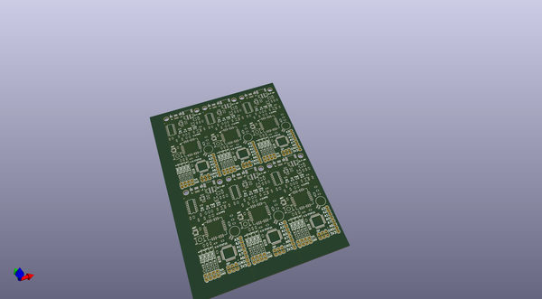

# OOMP Project  
## GeoFence  by sparkfunX  
  
oomp key: oomp_projects_flat_sparkfunx_geofence  
(snippet of original readme)  
  
- GeoFence  
A device to monitor when it is inside or outside various GPS waypoints.  
  
- The GeoFence App is no longer supported  
Unfortunately, Google has changed the way that they bill their Maps API and because we're no longer building the GeoFence hardware,   
we won't be updating the software. If you're looking for a way to create and enforce your own geofences, we encourage you to check out the [uBlox](https://learn.sparkfun.com/tutorials/getting-started-with-u-center-for-u-blox) products we now carry. If you still have a GeoFence board that you'd like to continue using, you have two options:  
  
1. You can aqcuire your own [Google Maps API Key](https://developers.google.com/maps/documentation/javascript/get-api-key),   
replace our key string in the app source code (index.html line 77), and recompile the app in [electronjs](https://electronjs.org/).  
  
2. You can construct your own configuration string using lat-long data from the source of your choosing and send it to the board using   
a serial terminal. Configuration strings are constructed as follows:  
  
-- Complete Configuration String  
  
| Header | Zone 1 | Zone 2 | Zone 3 | Zone 4 | Footer | Chksum | Terminator |  
| ------ | ------ | ------ | ------ | ------ | ------ | ------ | ---------- |  
| "$\n"  |        |        |        |        |  "^\n" |        |     "$"    |  
  
-- Zone Configuration  
  
--- Null Zone  
The device expects to see configurations for each zone, even if the zone is "unprogrammed". Unprogrammed zones are marked with th  
  full source readme at [readme_src.md](readme_src.md)  
  
source repo at: [https://github.com/sparkfunX/GeoFence](https://github.com/sparkfunX/GeoFence)  
## Board  
  
  
## Schematic  
  
  
  
[schematic pdf](working_schematic.pdf)  
## Images  
