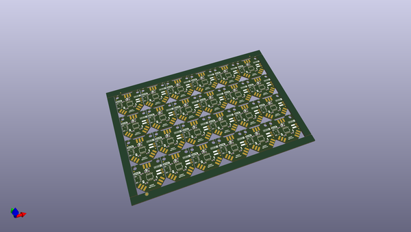

# OOMP Project  
## GNSS_Splitter  by sparkfunX  
  
oomp key: oomp_projects_flat_sparkfunx_gnss_splitter  
(snippet of original readme)  
  
- SparkX GNSS Antenna Splitter (Power Divider) with DC Pass  
  

  
    
    
    
    

  
  
  
  
*[SparkX GNSS Antenna Splitter (Power Divider) with DC Pass (SPX-21223)](https://www.sparkfun.com/products/21223)*  
  
The [SparkX GNSS Antenna Splitter (Power Divider) with DC Pass (SPX-21223)](https://www.sparkfun.com/products/21223) lets you connect a single GNSS antenna to two boards or modules. It splits (divides) the antenna signal from Port S equally between Port 1 and Port 2. It is the perfect accessory for our [NEO-D9S correction data receiver](https://www.sparkfun.com/products/19390), allowing you to feed both the NEO  
  full source readme at [readme_src.md](readme_src.md)  
  
source repo at: [https://github.com/sparkfunX/GNSS_Splitter](https://github.com/sparkfunX/GNSS_Splitter)  
## Board  
  
  
## Schematic  
  
  
  
[schematic pdf](working_schematic.pdf)  
## Images  
