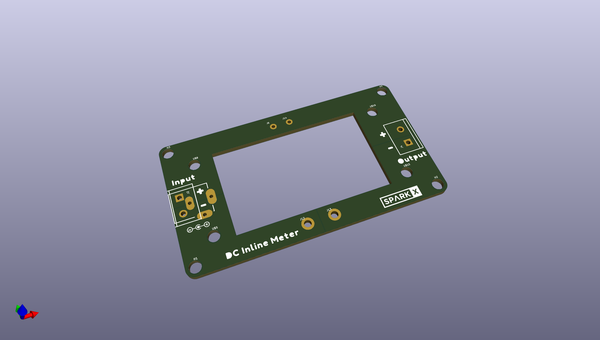

# OOMP Project  
## Inline-DC-Panel-Meter  by sparkfunX  
  
(snippet of original readme)  
  
SparkFun Inline DC Panel Meter  
========================================  
  
  
  
[*SparkFun Inline DC Panel Meter (SPX-18571)*](https://www.sparkfun.com/products/18571)  
  
  
The Inline DC Panel Meter Kit has all the bits you need to create an elegant, seamless DC volt/ameter. Measuring current usually means interrupting the VCC or ground return path, and 'interrupting' usually means cutting. We designed the kit to be used 'inline' - no need to cut wires just plug your wall wart into the kit and the kit into your target device. We found it to be really handy to measure various 12V devices (routers, WiFi APs, etc) up to 10 amps.  
  
DC Panel Meters are a great way to instantaneously see what the voltage and current requirements are of a device. But if you're like us, it's often hard to find a panel to mount the thing to! We designed the three PCBs to act as the 'panel' with plenty of clearance below the display. Anyone handy with a soldering iron and a screw driver will have this kit together in less than 10 minutes.  
  
  
  
  
  
SparkFun labored with love to create this code. Feel like supporting open source hardware?   
Buy a [kit](  
  full source readme at [readme_src.md](readme_src.md)  
  
source repo at: [https://github.com/sparkfunX/Inline-DC-Panel-Meter](https://github.com/sparkfunX/Inline-DC-Panel-Meter)  
## Board  
  
  
## Schematic  
  
  
  
[schematic pdf](working_schematic.pdf)  
## Images  
