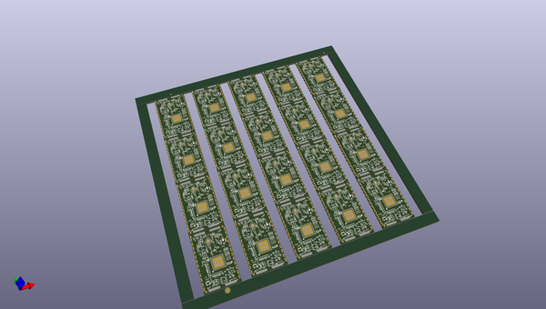

# OOMP Project  
## IOTA-ARTIC-R2-Module  by sparkfunX  
  
oomp key: oomp_projects_flat_sparkfunx_iota_artic_r2_module  
(snippet of original readme)  
  
- IOTA (Integrated Open-Source Transceiver for Argos)  
  
  
  
[*SparkX IOTA (SPX-17984)*](https://www.sparkfun.com/products/17984)  
  
The [ARGOS ARTIC R2 satellite communication chipset](https://www.cls-telemetry.com/argos-solutions/argos-products/modems/artic-chipset/-1534863095666-398318f3-c367) in castellated module format.  
  
  
  
The ARTIC-R2 is an integrated low power small size ARGOS 2/3/4 single chip radio. ARTIC-R2 implements a message based wireless interface. For satellite uplink communication, ARTIC-R2 will encode, modulate and transmit provided user messages. For downlink communication, ARTIC-R2 will lock to the downstream, demodulate and decode it and extract the satellite messages.  
  
The ARTIC-R2 can transmit signals in frequency bands around 400MHz and receive signals in the bands around 466MHz, in accordance with the ARGOS satellite system specifications. The ARTIC-R2 is compliant to all ARGOS 3 and ARGOS 4 RX and TX standards. It contains a RF transceiver and frequency synthesizer and a digital baseband modem. The ARTIC-R2 contains an on-chip power amplifier delivering 1mW [0dBm] output power, that serves as an output for connecting an external high efficient PA. The (de)modulation algorithms run on an on-chip DSP. This software approach allows for re  
  full source readme at [readme_src.md](readme_src.md)  
  
source repo at: [https://github.com/sparkfunX/IOTA-ARTIC-R2-Module](https://github.com/sparkfunX/IOTA-ARTIC-R2-Module)  
## Board  
  
  
## Schematic  
  
  
  
[schematic pdf](working_schematic.pdf)  
## Images  
