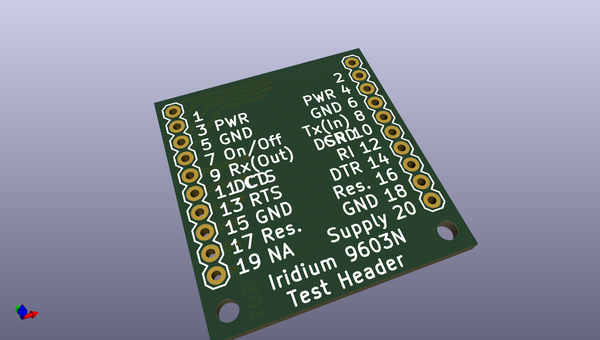

# OOMP Project  
## Iridium_9603N_Test_Header  by sparkfunX  
  
oomp key: oomp_projects_flat_sparkfunx_iridium_9603n_test_header  
(snippet of original readme)  
  
- Iridium 9603N Test Header  
  
  
A test header which mimics the Iridium 9603N, to aid circuit board debugging. Fitted with a Samtec ST4-10-2.50.  
  
  
  
  
  
  
-- Repository Contents  
- **/Hardware** - Eagle schematic and PCB design files  
- **LICENSE.md** contains the licence information  
  
Enjoy!  
  
**_Paul_**  
  
  
  
  
  full source readme at [readme_src.md](readme_src.md)  
  
source repo at: [https://github.com/sparkfunX/Iridium_9603N_Test_Header](https://github.com/sparkfunX/Iridium_9603N_Test_Header)  
## Board  
  
  
## Schematic  
  
  
  
[schematic pdf](working_schematic.pdf)  
## Images  
